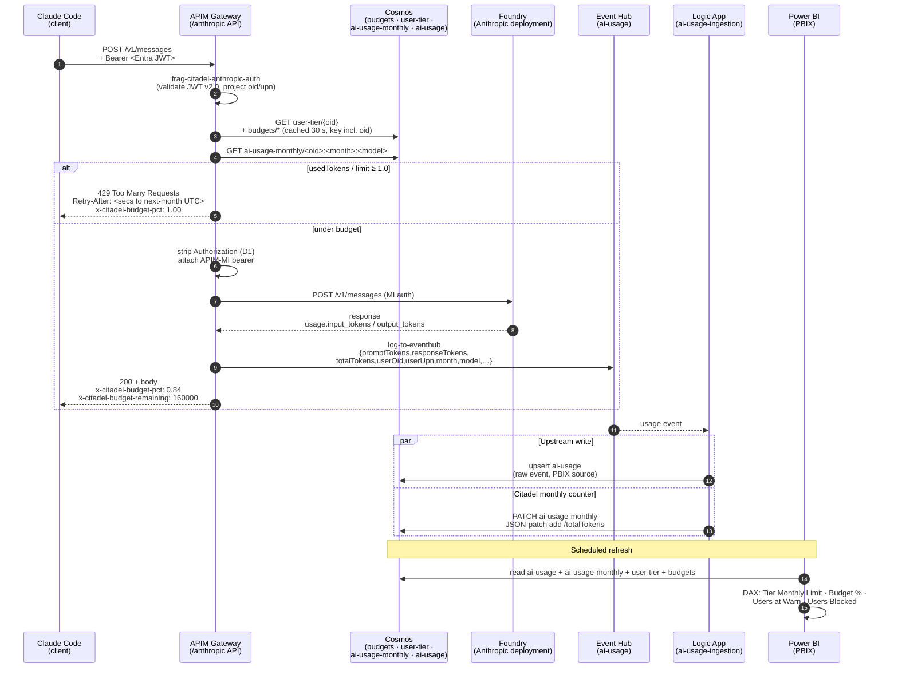

# Citadel Budgets — Overlay on Citadel Governance Hub

**Audience:** customer review.
**Status:** Paper-only design (no live Azure tenant yet). All `<placeholder>` values are intentional — they become Bicep parameters / Named Values at deploy time.
**Base:** Fork of [`Azure-Samples/ai-hub-gateway-solution-accelerator@citadel-v1`](https://github.com/Azure-Samples/ai-hub-gateway-solution-accelerator/tree/citadel-v1) (a.k.a. "Citadel Governance Hub", Layer 1 of the Foundry Citadel Platform).
**Purpose:** This document enumerates the **deltas** Citadel Budgets introduces on top of upstream `citadel-v1`. Files under this repo root (`bicep/`, `src/`, `validation/`) mirror upstream paths; only the changed/new files are committed.

---

## 1. Decisions locked (D1–D6)

| ID | Decision | One-liner |
|----|----------|-----------|
| D1 | Identity | Pass-through Entra JWT; audience = Anthropic-published Claude Code app ID. |
| D2 | Granularity | Hybrid: tier + per-user × per-model. Precedence `(oid,model) → (oid,*) → (tier,model) → (tier,*) → global`. |
| D3 | Counter store | Cosmos + APIM `cache-lookup-value` (~30s TTL). |
| D4 | Enforcement | 80% soft warn header, 100% hard 429 with `Retry-After` to next month UTC. `adminOverride=true` bypasses. |
| D5 | Provisioning | Bicep-as-code Citadel Access Contracts (tiers + per-user overlays). No Power App in POC. |
| D6 | Reporting | Extend existing PBIX. No Fabric in POC. |

## 2. Phase 0.a decision (paper)

**Path B chosen: dedicated `/anthropic` API** in APIM (not "extend Unified AI Wildcard"). Anthropic's Messages API shape (request `content` blocks, SSE `message_delta` terminal event with `usage.output_tokens`) is structurally distinct from OpenAI Chat Completions; normalizing through Unified AI would be lossy and risk regressing existing OpenAI consumers. Cost: 1 OpenAPI spec + ~5 new policy fragments. See `.github/prompts/plan-citadelBudgets.prompt.md` for full rationale.

## 3. What this overlay touches (vs. upstream `citadel-v1`)

Legend: ✱ = new file; ✎ = modified upstream file (shown as a small overlay/patch, full file lives upstream); — = upstream file referenced but unchanged.

### 3.1 APIM (`bicep/infra/modules/apim/`)

| File | Type | Purpose | Maps to |
|------|------|---------|---------|
| `policies/frag-citadel-anthropic-auth.xml` | ✱ | Forked from upstream `frag-aad-auth-custom.xml`. Three deltas: (1) **v2.0 issuer** (upstream bug L7 — issues v1 `sts.windows.net`, violates Microsoft guidance); (2) **no `appid` required-claim** (Citadel does not own the Anthropic app manifest, cannot constrain `appid`); (3) **captures `oid` + `preferred_username`** into context variables for downstream telemetry + budget enforcement. | D1, Phase 1 |
| `policies/frag-citadel-anthropic-usage.xml` | ✱ | Forked from `frag-ai-usage.xml`. Maps Anthropic `usage.input_tokens` → existing `promptTokens` field; `usage.output_tokens` → existing `responseTokens`. Adds `userOid` + `userUpn` fields to the Event Hub payload (Phase 2 telemetry enrichment). PBIX schema stays backward-compatible. | Phase 2 |
| `policies/frag-citadel-anthropic-usage-streaming.xml` | ✱ | Forked from `frag-openai-usage-streaming.xml`. Reads terminal SSE `message_delta` event for the final `usage.output_tokens`. Emits same Event Hub schema as the non-streaming variant. | Phase 2 |
| `policies/frag-citadel-budget-check.xml` | ✱ | Implements D2 precedence chain + D3 cache + D4 enforcement. Reads Cosmos via `send-request`; caches per `oid` with 30s TTL (cache key always includes `oid` — D3 + Risk #4). On `pct >= 1.0` returns 429 with `Retry-After` = seconds until next-month UTC. `adminOverride=true` short-circuits. Emits `x-citadel-budget-pct` / `x-citadel-budget-remaining` response headers. | D2, D3, D4, Phase 4c |
| `policies/anthropic-api-policy.xml` | ✱ | API-level inbound/outbound stack: include auth fragment → strip inbound `Authorization` (D1) → include budget-check → forward to Foundry backend with APIM-MI bearer → outbound usage fragment + outbound budget counter increment. | Phase 0.b, Phase 4c |
| `anthropic/anthropic-api-spec.yaml` | ✱ | Minimal hand-written OpenAPI surface: `POST /v1/messages` only (the operation Claude Code uses). Streaming via the same operation with `stream: true`. | Phase 0.b |
| `anthropic/anthropic-api.bicep` | ✱ | APIM `apis` + `apis/policies` + `backends` resources. Backend points at `<foundry-anthropic-endpoint>` placeholder; auth = APIM managed identity (MI). | Phase 0.b |
| `apim.bicep` | ✎ | **Overlay patch** (see `bicep/infra/modules/apim/apim.citadel-patch.md`): registers the 4 new fragments + 1 new Named Value `claude-code-app-id`. Wires `anthropic-api.bicep` into the existing API-registration block at line ~726. | Phase 0.b, Phase 1 |

### 3.2 Cosmos (`bicep/infra/modules/cosmos-db/`)

| File | Type | Purpose | Maps to |
|------|------|---------|---------|
| `cosmos-db.citadel.bicep` | ✱ | Extension module that adds three containers to the existing `ai-usage-db` database: `budgets` (PK `/scope`), `user-tier` (PK `/oid`), `ai-usage-monthly` (PK `/oid`). All seeded via Access Contracts + Logic App ingestion. | Phase 2, Phase 4a |
| `cosmos-db.bicep` | — | Untouched. The extension module references the existing database account and database. |

### 3.3 Citadel Access Contracts (`bicep/infra/citadel-access-contracts/`)

Upstream already has the Access Contracts pattern (`main.bicep`, `modules/`, `policies/`). We extend it with **tier contracts** + **per-user override contracts** + a shared **budget-seed** helper.

| File | Type | Purpose | Maps to |
|------|------|---------|---------|
| `_shared/budget-seed.bicep` | ✱ | Reusable module that runs a deployment-script to upsert a budget doc into the `budgets` Cosmos container. Idempotent. Used by every tier file and every user-override file. | D5 |
| `citadel-tiers/bronze.bicep` | ✱ | Tier contract: `scope=tier:bronze`, monthly budget = 200 000 tokens (placeholder). | D2, D5 |
| `citadel-tiers/silver.bicep` | ✱ | Tier contract: `scope=tier:silver`, monthly budget = 1 000 000 tokens (placeholder). | D2, D5 |
| `citadel-tiers/gold.bicep` | ✱ | Tier contract: `scope=tier:gold`, monthly budget = 5 000 000 tokens; `perModelOverrides.claude-opus-4 = 2 000 000`. | D2, D5 |
| `citadel-tiers/main.bicepparam` | ✱ | Placeholder Entra group IDs: `<tier-group-oid-bronze>`, `<tier-group-oid-silver>`, `<tier-group-oid-gold>`. | A2 |
| `user-overrides/EXAMPLE-user-override.bicep` | ✱ | Illustrative per-user override: `scope=user:<placeholder-oid>`, custom monthly cap. **Each real override becomes its own Bicep PR** — that's the audit trail (D5). | D2, D5 |

### 3.4 Usage ingestion (`src/usage-ingestion-logicapp/`)

| File | Type | Purpose | Maps to |
|------|------|---------|---------|
| `ai-usage-ingestion/workflow.citadel-patch.json` | ✱ | **Patch overlay** — JSON snippet showing the two new Logic App actions inserted into the upstream `workflow.json`: (1) `Project_userOid_userUpn_month` (Compose action that adds the three fields), (2) `Upsert_ai_usage_monthly` (Cosmos PATCH `Add` on `totalTokens`, keyed `<oid>:<month>:<model>`). Full merged workflow ships at deploy time. | Phase 2 |
| `ai-usage-ingestion/README.citadel.md` | ✱ | Explains the patch + how to apply it to the upstream workflow during deployment. | Phase 2 |

### 3.5 Tier sync (new — `src/tier-sync-function/`)

| File | Type | Purpose | Maps to |
|------|------|---------|---------|
| `src/tier-sync-function/host.json` | ✱ | Function App skeleton. | Phase 4b |
| `src/tier-sync-function/tier-sync/index.ts` | ✱ | Timer-triggered TypeScript: enumerates configured tier groups, calls Graph `/groups/{id}/transitiveMembers`, upserts `user-tier` Cosmos docs, removes orphans. | Phase 4b |
| `src/tier-sync-function/tier-sync/function.json` | ✱ | Timer binding (every 6h) + Cosmos output binding. | Phase 4b |
| `src/tier-sync-function/tier-sync-function.bicep` | ✱ | Function App + MI + Graph permission grant + app settings (group→tier map sourced from the same Bicep params as the tier contracts). | Phase 4b |

### 3.6 Validation notebooks (`validation/`)

| File | Type | Purpose | Maps to |
|------|------|---------|---------|
| `citadel-anthropic-surface-tests.ipynb` | ✱ | Tests `POST /v1/messages` end-to-end through APIM. Each cell ships with a `## Validation gate` markdown preamble listing the live preconditions (tenant ID, app reg, Foundry deployment, test JWT). **Cannot run paper-only.** | Phase 0.b verify |
| `citadel-budget-enforcement-tests.ipynb` | ✱ | Seeds a `user:<oid>` budget doc with `monthlyTokenLimit=1000`, drives traffic until 100%, asserts `x-citadel-budget-pct` header progression + 429 with correct `Retry-After`. Tests `adminOverride=true` bypass. | Phase 4 verify |
| `citadel-jwt-authentication-tests.ipynb` | — | Upstream notebook — reused with one new test case (see `citadel-jwt-authentication-tests.citadel-patch.md` overlay note for the added cells). | Phase 1 verify |

### 3.7 Power BI report (`src/usage-reports/`)

The upstream PBIX is binary, so the Citadel delta is delivered as **(a)** Claude pricing rows seeded into the existing `model-pricing` Cosmos container and **(b)** a one-time set of in-Desktop edits the customer BI engineer applies after first import.

| File | Type | Purpose | Maps to |
|------|------|---------|---------|
| `src/usage-reports/model-pricing.citadel.json` | ✱ | Three Anthropic model-pricing rows (`claude-haiku-3-5`, `claude-sonnet-4`, `claude-opus-4`) — list pricing as of May 2026. Upserted into the existing `model-pricing` container; no schema change. | D6, Phase 2 |
| `src/usage-reports/README.citadel.md` | ✱ | Step-by-step PBIX patch: add `user-tier` + `ai-usage-monthly` data sources, build the `oid` relationship, add 4 DAX measures (`Tier Monthly Limit`, `Budget %`, `Users at Warn`, `Users Blocked`), add the per-user page + tier slicer. Includes a privacy/DPO checkpoint before publish. | D6, Phase 5 |
| `AI-Hub-Gateway-Usage-Report-v1-5-Incremetal.pbix` | — | Upstream binary — reused unchanged on first open. The README patch is applied once, then the PBIX is re-saved into the customer Power BI workspace under a Citadel-versioned name. |

> Token fields stay backward-compatible: APIM maps Anthropic `usage.input_tokens`→`promptTokens` and `usage.output_tokens`→`responseTokens`, so the existing PBIX visuals keep working untouched. The Citadel additions are **purely additive** (new dim, new measures, new page).

### 3.8 Top-level wiring

| File | Type | Purpose |
|------|------|---------|
| `bicep/infra/main.citadel.bicep` | ✱ | Citadel orchestrator. References upstream `main.bicep` outputs (APIM, Cosmos, KV) and deploys the Anthropic API module + Cosmos extension + tier-sync Function + tier contracts. |
| `bicep/infra/main.citadel.bicepparam` | ✱ | Placeholder params: `claudeCodeAppId='<claude-code-app-id>'`, `customerTenantId='<customer-tenant-id>'`, `foundryAnthropicEndpoint='<foundry-anthropic-endpoint>'`, `claudeDeploymentName='<claude-deployment-name>'`, `tierGroupMap={bronze:'<tier-group-oid-bronze>', …}`. |

---

## 4. Customer review checklist

Before first deployment, the customer needs to supply (and only the customer can):

| # | Value | Bicep param | Notes |
|---|-------|-------------|-------|
| 1 | Claude Code Entra app ID | `claudeCodeAppId` | From Entra portal → Enterprise applications → Claude Code → Application ID. Multi-tenant Anthropic-published app; tenant admin consent already implied by the Claude Code rollout. |
| 2 | customer tenant ID | `customerTenantId` | From Entra portal → Tenant overview. Used in v2.0 issuer URL. |
| 3 | Foundry Anthropic endpoint | `foundryAnthropicEndpoint` | Foundry resource URL for the Anthropic deployment, e.g. `https://<foundry-name>.openai.azure.com` (subject to Foundry's actual Anthropic endpoint pattern — confirm at provision). |
| 4 | Claude deployment name | `claudeDeploymentName` | Foundry deployment name (e.g. `claude-sonnet-4`). |
| 5 | Tier group object IDs | `tierGroupMap` | Entra group object IDs (one per tier) used by the tier-sync Function. |
| 6 | Tier budget limits | per-tier `.bicepparam` | Default placeholders: bronze 200k / silver 1M / gold 5M tokens/month. Adjust to reality. |

## 5. What this overlay deliberately does NOT do (POC scope)

- No Power App admin UI (D5).
- No Fabric migration (D6).
- No cost-based budgets (token-based only; cost calc lives in PBIX).
- No multi-region Cosmos DR.
- No audit-log container — **IaC commits to this repo are the audit trail**.
- No upstream code rewrite — every Citadel addition is either a new file or an additive patch.

## 6. Future consolidation note (Path A revisit)

Phase 0.a chose Path B (dedicated `/anthropic` API). If a future Foundry release exposes a unified provider-agnostic surface, the four `frag-citadel-anthropic-*.xml` fragments can be migrated under the Unified AI Wildcard API by changing only their `<choose>` provider-gate; no schema or downstream consumer change required.

## 7. Logging & telemetry architecture (end-to-end example)

This section walks one request through every logging hop, from the Claude Code client all the way to the Power BI dashboard. It is the single best place to start when reasoning about *"where did this token count come from?"* or *"why did APIM return 429 for user X?"*.

### 7.1 Components and their roles

| Hop | Component | What it emits | Where it lands |
|-----|-----------|---------------|----------------|
| 1 | **Claude Code (client)** | `POST /v1/messages` + Entra JWT (audience = `claude-code-app-id`) | APIM gateway |
| 2 | **APIM — auth fragment** ([`frag-citadel-anthropic-auth.xml`](bicep/infra/modules/apim/policies/frag-citadel-anthropic-auth.xml)) | Validates JWT (v2.0 issuer); projects `userOid`, `userUpn` into context vars | APIM trace + downstream fragments |
| 3 | **APIM — budget-check fragment** ([`frag-citadel-budget-check.xml`](bicep/infra/modules/apim/policies/frag-citadel-budget-check.xml)) | Reads `user-tier` + `budgets` + `ai-usage-monthly` (cache 30 s, key includes `oid`); emits `x-citadel-budget-pct` / `x-citadel-budget-remaining` headers; on 100 % returns `429` with `Retry-After` | Response headers + 4xx logs |
| 4 | **Foundry — Anthropic deployment** | Anthropic response with `usage.input_tokens` + `usage.output_tokens` (streaming: terminal `message_delta`) | Returned to APIM |
| 5 | **APIM — usage fragment** ([`frag-citadel-anthropic-usage.xml`](bicep/infra/modules/apim/policies/frag-citadel-anthropic-usage.xml) / [`-streaming.xml`](bicep/infra/modules/apim/policies/frag-citadel-anthropic-usage-streaming.xml)) | Maps Anthropic → `{promptTokens, responseTokens, totalTokens, userOid, userUpn, month, model, …}`; `log-to-eventhub` | Event Hub `ai-usage` |
| 6 | **Logic App** ([`workflow.citadel-patch.json`](src/usage-ingestion-logicapp/ai-usage-ingestion/workflow.citadel-patch.json)) | Two writes in parallel after `Parse_Usage_Event`: (a) raw event → `ai-usage` Cosmos container (upstream), (b) JSON-patch `add` on `/totalTokens` → `ai-usage-monthly` (Citadel) | Cosmos `ai-usage-db` |
| 7 | **Cosmos `ai-usage-monthly`** | Doc id `<oid>:<YYYY-MM>:<model>`, TTL 90 d, partition key `/oid` | Authoritative counter read at hop 3 of the **next** request |
| 8 | **Power BI** ([`README.citadel.md`](src/usage-reports/README.citadel.md)) | DAX measures `Tier Monthly Limit`, `Budget %`, `Users at Warn`, `Users Blocked` over the Cosmos data sources | Refresh-time dashboard |

### 7.2 End-to-end flow diagram

### 7.3 Worked example — one streaming request, ending the month

Context: user `alice@contoso.com` (`oid=a1b2…`) is in tier `silver` (limit 1 000 000 tokens / month). She has used 998 500 tokens this month for `claude-sonnet-4`. She fires off a streaming chat from Claude Code.

| Step | Observable signal |
|------|-------------------|
| Request enters APIM | trace shows `userOid=a1b2…`, `model=claude-sonnet-4`, `isStream=true` |
| Budget-check | reads `ai-usage-monthly/a1b2…:2026-05:claude-sonnet-4 → totalTokens=998500`; tier-silver limit `1 000 000`; pct=`0.9985` → **soft warn**, no 429 |
| Response | client sees `x-citadel-budget-pct: 1.00` (rounded after this call's tokens are added in the outbound increment) and `x-citadel-budget-remaining: 0`; SSE stream completes normally |
| Outbound — streaming fragment | parses terminal `message_delta` → `usage.output_tokens=1800`, plus the prompt's `input_tokens=320`; emits Event Hub event `{promptTokens:320, responseTokens:1800, totalTokens:2120, month:"2026-05", userOid:"a1b2…", userUpn:"alice@contoso.com", model:"claude-sonnet-4"}` |
| Logic App | (a) appends raw event to `ai-usage`; (b) `PATCH ai-usage-monthly … add /totalTokens 2120` → new value `1 000 620` |
| Next request (≤ 30 s later) | budget-check **may** still serve cached `998 500` and let one more call through — this is the deliberate ~30 s slack documented in D3. Within 30 s the cache expires, next read sees `1 000 620 / 1 000 000 = 1.006` → APIM returns **`429 Too Many Requests`** with `Retry-After` = seconds until `2026-06-01T00:00:00Z` |
| Admin override | a one-off Bicep PR sets `adminOverride=true` on the `user:a1b2…` doc; the next budget-check short-circuits and resumes 200s without bumping the limit |
| Power BI | next refresh shows Alice in the **Users Blocked** measure; tier-silver page shows `Budget % = 100.06 %` |

### 7.4 Identity & PII handling

- Event Hub + both Cosmos containers persist `oid` (stable, non-PII identifier) **and** `upn` (PII — email-shaped). `upn` is captured only for the PBIX "who hit the limit" view. Customers who classify `upn` as PII can drop the field at the APIM usage fragment with a one-line edit — the rest of the pipeline keys on `oid`.
- APIM **strips the inbound `Authorization` header before forwarding to Foundry** (D1). The user JWT is never persisted; only the claims (`oid`, `upn`) the auth fragment promotes into context vars are.
- `groups`/`roles` claims are deliberately *not* read — they don't exist on the Anthropic-published Claude Code app (see [skills/entra-jwt-claude-code/SKILL.md](.github/skills/entra-jwt-claude-code/SKILL.md)). Tier comes from Cosmos `user-tier`, populated by the tier-sync Function.

### 7.5 Verification gates

| Test | Notebook |
|------|----------|
| End-to-end `POST /v1/messages` round trip (auth + Foundry forwarding + usage emit) | [validation/citadel-anthropic-surface-tests.ipynb](validation/citadel-anthropic-surface-tests.ipynb) |
| 80 % / 100 % thresholds, `Retry-After` math, `adminOverride` bypass | [validation/citadel-budget-enforcement-tests.ipynb](validation/citadel-budget-enforcement-tests.ipynb) |

---

## 8. Where to dig in next

1. Read the auth fragment first: [bicep/infra/modules/apim/policies/frag-citadel-anthropic-auth.xml](bicep/infra/modules/apim/policies/frag-citadel-anthropic-auth.xml).
2. Then the budget-check fragment: [bicep/infra/modules/apim/policies/frag-citadel-budget-check.xml](bicep/infra/modules/apim/policies/frag-citadel-budget-check.xml).
3. Then a tier contract: [bicep/infra/citadel-access-contracts/citadel-tiers/gold.bicep](bicep/infra/citadel-access-contracts/citadel-tiers/gold.bicep).
4. Then the validation gates: [validation/citadel-budget-enforcement-tests.ipynb](validation/citadel-budget-enforcement-tests.ipynb).
