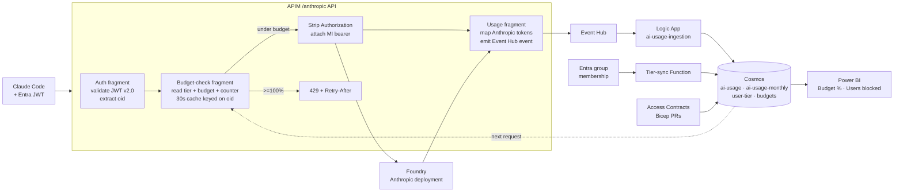

# Citadel Budgets

> Per-user AI token budgets and reporting for **Claude Code on Microsoft Foundry**, delivered as a paper-only overlay on the [Citadel Governance Hub](https://github.com/Azure-Samples/ai-hub-gateway-solution-accelerator/tree/citadel-v1).

**Audience for this README:** Cloud Center of Excellence (CCoE) and AI Center of Excellence (AI CoE) teams evaluating whether to adopt, sponsor, or extend this overlay.

For implementation detail jump to [CITADEL-OVERLAY.md](CITADEL-OVERLAY.md). For repo conventions see [AGENTS.md](AGENTS.md).

---

## 1. The need — why CCoE & AI CoE should care

Anthropic's Claude models are now consumable through **Microsoft Foundry**, and developer teams want to wire them into Claude Code. That creates three problems landing squarely in CoE territory:

| Stakeholder | Concern | Without Citadel Budgets |
|-------------|---------|-------------------------|
| **CCoE** (FinOps, governance) | "How do I keep AI spend predictable per user, per business unit, per model — without throwing the platform's roadmap out the window every time a new model lands?" | Foundry meters at the *deployment* level. A single runaway user can burn the monthly budget of an entire BU before the next invoice cycle. |
| **AI CoE** (productivity, fair access) | "How do I give 500 developers access to Claude Code without one team's experiment starving the rest, and without manually provisioning per-team Foundry deployments?" | Either everyone shares one bucket (no fairness) or every team gets its own deployment (sprawl, quota fragmentation, ops drag). |
| **Security / Identity** | "Claude Code authenticates with an **Anthropic-published** multi-tenant Entra app whose manifest we cannot edit. We can't add custom roles or scopes. How do we still enforce tiered access?" | Either you turn the app off entirely or you accept a flat, anonymous-to-Entra usage pattern. |

Existing controls don't close the gap:

- **Foundry quotas** are per-deployment, not per-user.
- **Azure budgets / Cost Management** alert on dollars after the fact, with hours of latency.
- **APIM rate limits** count requests, not tokens, and don't understand monthly windows.
- **Power BI dashboards** (already shipped in the Governance Hub) show usage but cannot *enforce*.

CCoE and AI CoE need a control plane that is **per-user, per-model, monthly, token-aware, real-time, and provisioned as code** — without forking Foundry or asking Anthropic to re-publish their Entra app.

## 2. The challenge — what makes this hard

Four constraints reshape the design:

1. **Identity is fixed.** Claude Code's JWT is issued to a **multi-tenant app published by Anthropic**. The customer tenant cannot add `groups`, `roles`, or custom scopes to that manifest. Tier resolution must be a *server-side* lookup, not a token claim.
2. **Anthropic's API shape ≠ OpenAI's.** Token usage lives in `usage.input_tokens` / `usage.output_tokens`. Streaming completion is signalled by a **terminal `message_delta` SSE event**, not the OpenAI `data: [DONE]` line. Existing Governance Hub usage policies — OpenAI-shaped — would silently drop counts.
3. **Enforcement must be fast.** A budget check that adds 200 ms to every Claude Code call is a non-starter for an interactive coding assistant. Yet the check has to read fresh counters to stop runaways.
4. **The audit trail must survive the POC.** No standalone admin UI exists in the POC budget. Whatever provisions "who has what budget" must itself be reviewable, diff-able, and revertable — i.e. **infrastructure as code**, not a spreadsheet or a portal click.

## 3. The solution — what Citadel Budgets adds

A thin **overlay** on top of the upstream Citadel Governance Hub. Same APIM, same Cosmos, same Event Hub, same Power BI — plus four new APIM policy fragments, three new Cosmos containers, one tier-sync Function, and a small Logic App patch.



### How each constraint is resolved

| Constraint | Resolution | Where it lives |
|------------|------------|----------------|
| Identity is fixed | **Pass-through JWT** (D1). APIM validates v2.0 issuer + Anthropic audience, extracts `oid`. Tier is looked up from Cosmos `user-tier`, kept in sync from Entra by a Function — no manifest changes required. | [`frag-citadel-anthropic-auth.xml`](bicep/infra/modules/apim/policies/frag-citadel-anthropic-auth.xml), [`src/tier-sync-function/`](src/tier-sync-function/) |
| Anthropic API shape | Two dedicated usage fragments — one for unary, one for streaming `message_delta`. They map Anthropic's `input_tokens`/`output_tokens` onto the **existing** `promptTokens`/`responseTokens` Event Hub schema, so the upstream Logic App and PBIX keep working unchanged. | [`frag-citadel-anthropic-usage.xml`](bicep/infra/modules/apim/policies/frag-citadel-anthropic-usage.xml), [`frag-citadel-anthropic-usage-streaming.xml`](bicep/infra/modules/apim/policies/frag-citadel-anthropic-usage-streaming.xml) |
| Enforcement must be fast | Counter reads are served from APIM's `cache-lookup-value` with **~30 s TTL keyed on `oid`** (D3). Worst-case overrun is one extra request per user per month — quantified and accepted. Hard 100% blocks return **429 with `Retry-After` = seconds until next-month UTC**. 80% emits a soft warn response header. `adminOverride=true` bypasses for incident response (D4). | [`frag-citadel-budget-check.xml`](bicep/infra/modules/apim/policies/frag-citadel-budget-check.xml) |
| Audit trail | Budgets and per-user overrides are **Bicep files in source control** — Citadel Access Contracts (D5). Tier contracts live in [`citadel-tiers/`](bicep/infra/citadel-access-contracts/citadel-tiers/); each per-user override is its own PR in [`user-overrides/`](bicep/infra/citadel-access-contracts/user-overrides/). The PR history *is* the audit log. | [`bicep/infra/citadel-access-contracts/`](bicep/infra/citadel-access-contracts/) |

### What you get on day one

- **Per-user × per-model token budgets** with documented precedence: `(oid, model) → (oid, *) → (tier, model) → (tier, *) → global`.
- **Tiered defaults** (bronze / silver / gold) driven by Entra group membership, no manifest editing.
- **Real-time soft-warn (80%) and hard-block (100%)** at the APIM layer — Claude Code sees standard HTTP semantics it already handles.
- **Power BI dashboard** extended with `Budget %`, `Users at Warn`, `Users Blocked` measures — same PBIX customers already deploy with the Governance Hub.
- **Two validation notebooks** that act as the executable acceptance criteria: [Anthropic surface tests](validation/citadel-anthropic-surface-tests.ipynb) and [budget enforcement tests](validation/citadel-budget-enforcement-tests.ipynb).

### What is deliberately out of scope (POC)

To keep the surface area honest:

- Power App admin UI (Bicep PRs are the UI).
- Migration to Microsoft Fabric (existing PBIX is sufficient).
- Cost-based — as opposed to token-based — budgets.
- Multi-region Cosmos disaster recovery.
- A dedicated audit-log container (Git history fills that role).

These are tracked as follow-ups in [CITADEL-OVERLAY.md](CITADEL-OVERLAY.md) and the plan prompt under [`.github/prompts/plan-citadelBudgets.prompt.md`](.github/prompts/plan-citadelBudgets.prompt.md).

## 4. Where Citadel Budgets fits in the broader platform

```
┌─────────────────────────────────────────────────────────────┐
│  Foundry Citadel Platform (reference architecture)          │
│                                                             │
│   Layer 1 — Governance Hub  (upstream citadel-v1)           │
│     · APIM + Cosmos + Event Hub + Logic App + PBIX          │
│     · Citadel Access Contracts (use-case ceilings)          │
│                                                             │
│   ─── Citadel Budgets (this repo) ────────────────────────  │
│     · Per-user fair-share INSIDE each use-case ceiling      │
│     · Anthropic / Claude Code surface                       │
│                                                             │
│   Layer 2+ — Foundry workloads, agents, RAG, etc.           │
└─────────────────────────────────────────────────────────────┘
```

Budgets are a **superset overlay** on Access Contracts, not a replacement. A contract sets the use-case ceiling ("BU-X is allowed 50 M tokens / month against Claude"); the budget enforces fair-share *within* that ceiling ("Alice gets 1 M of it"). Both are provisioned as code; budgets are seeded from tier contracts on deploy.

## 5. Adoption guide for CoE teams

A typical CCoE / AI CoE engagement with this overlay follows four steps:

1. **Read the deltas.** Skim [CITADEL-OVERLAY.md](CITADEL-OVERLAY.md) §1–§3 to confirm the locked decisions (D1–D6) match your governance posture.
2. **Map your tiers.** Decide what bronze / silver / gold mean in tokens and which Entra groups back them. Edit [`citadel-tiers/main.bicepparam`](bicep/infra/citadel-access-contracts/citadel-tiers/main.bicepparam).
3. **Trace one request.** Walk [CITADEL-OVERLAY.md §7](CITADEL-OVERLAY.md#7-logging--telemetry-architecture-end-to-end-example) — the end-to-end logging architecture with a worked example — so your operations team knows exactly which logs to pull when a user calls support saying "I got a 429".
4. **Run the gates.** Execute the two notebooks under [`validation/`](validation/) against a paper deployment. Green = ready to pilot.

## 6. Status

This repository is **paper-only**. No live Azure tenant is yet provisioned. All `<placeholder>` values in Bicep are intentional — they become parameters / Named Values at deploy time. The repo's purpose is design-review, customer alignment, and pre-implementation sign-off.

When the design clears review, this repo becomes the fork commit-base against `citadel-v1`; the overlay files merge directly into the upstream paths they shadow.
